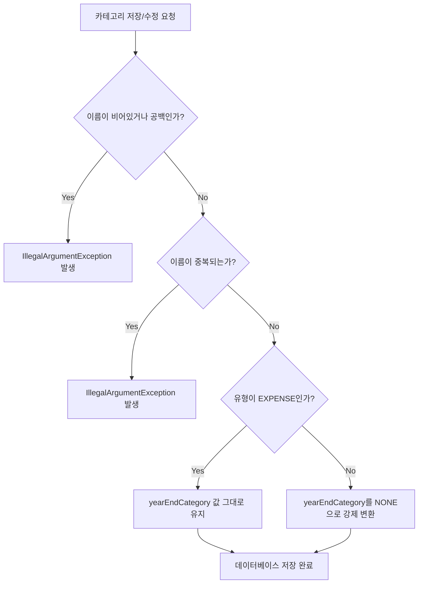

# Data Model Design: Category Validation & Constraints

본 설계 문서에서는 카테고리 데이터 모델의 검증 규칙과 예외 처리 기준을 정의한다.

## 1. Category 엔티티 명세 및 스키마 검증

### Category 테이블 및 속성
- **`name`** (`varchar(255)`):
  - 카테고리 이름.
  - **제약 조건**: `NOT NULL`, `UNIQUE` (중복 불가), 공백 불가.
  - **비즈니스 검증**: 저장/수정 전 앞뒤 공백을 Trim 처리한 후 빈 문자열(`""`)이면 `IllegalArgumentException`을 발생시킨다.
- **`type`** (`enum('EXPENSE','INCOME','TRANSFER')`):
  - 거래 구분 유형.
  - **제약 조건**: `NOT NULL`.
- **`year_end_category`** (`enum('NONE','PUBLIC_TRANSPORT','TRADITIONAL_MARKET')`):
  - 연말정산 분류 매핑 정보.
  - **제약 조건**: `NULL` 허용.
  - **비즈니스 검증**: `type`이 `INCOME` 또는 `TRANSFER`인 경우 데이터베이스 저장 전 강제로 `NONE`으로 세팅한다.

---

## 2. 상태 전이 및 유효성 검증 흐름

### 이름 중복 검증 규칙
- **신규 카테고리 생성 시**: `categoryRepository.existsByName(request.name())`이 `true`이면 예외 발생.
- **기존 카테고리 수정 시**: `categoryRepository.findByName(request.name())`으로 조회된 기존 카테고리가 존재하고, 그 카테고리의 `id`가 현재 수정 대상 카테고리의 `id`와 다른 경우 예외 발생.
